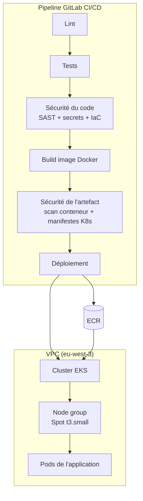

# Déploiement Cloud & DevSecOps

Mise en place d'un pipeline CI/CD complet et déploiement réel d'une application
conteneurisée sur un cluster Kubernetes managé (Amazon EKS), avec des contrôles
de sécurité intégrés à chaque étape (SAST, scan de secrets, scan de
vulnérabilités conteneur, scan de sécurité de l'infrastructure-as-code).

**Stack :** AWS (EKS, ECR, VPC, IAM, KMS) · Terraform · Docker · Kubernetes ·
GitLab CI/CD · Trivy · Checkov/tfsec · Semgrep · Gitleaks

## 1. Ce qui a été réellement déployé

Contrairement à un exercice purement théorique, ce projet a été **déployé pour
de vrai** sur un compte AWS réel : cluster EKS créé, application conteneurisée
construite et poussée sur ECR, déployée sur le cluster, vérifiée en
fonctionnement, puis détruite proprement (`terraform destroy`) pour ne pas
laisser de frais courir inutilement. Toutes les preuves (sorties de commandes
réelles) sont dans `reports/`.

## 2. Architecture



## 3. Sécurité mise en œuvre à chaque étape

| Étape | Contrôle |
|---|---|
| Code | SAST (Semgrep), scan de secrets (Gitleaks) |
| Infrastructure (Terraform) | Scan de sécurité IaC (tfsec, Checkov), état chiffré KMS, versions de modules épinglées |
| Image Docker | Build multi-stage, utilisateur non-root (UID 10001), scan de vulnérabilités (Trivy, politique "ignore-unfixed") |
| Registre (ECR) | Scan automatique à chaque push, tags immuables |
| Kubernetes | Pod Security Standard "restricted", contexte de sécurité restrictif (pas de privilège, FS en lecture seule, capacités Linux supprimées), NetworkPolicy par défaut-refus, quotas de ressources |
| Réseau AWS | API du cluster restreinte par IP, VPC Flow Logs, logs d'audit du control plane |
| Déploiement | Validation humaine obligatoire avant la production (`when: manual`) |

Toutes les décisions de sécurité (y compris celles **non** appliquées et pourquoi)
sont documentées dans [`SECURITY_EXCEPTIONS.md`](SECURITY_EXCEPTIONS.md).

## 4. Reproduire le déploiement

```bash
# 1. Bootstrap de l'état Terraform distant (une seule fois)
cd terraform/bootstrap
terraform init
terraform apply -var="state_bucket_name=<nom-unique>"

# 2. Infrastructure (VPC + EKS + ECR)
cd ../environments/dev
terraform init -backend-config="bucket=<nom-unique>" -backend-config="dynamodb_table=cloud-devsecops-pipeline-tf-locks"
terraform plan -out=dev.tfplan
terraform apply "dev.tfplan"

# 3. Add-ons du cluster (autoscaling)
../../../scripts/install_cluster_addons.sh

# 4. Build, push, déploiement de l'application
../../../scripts/deploy.sh dev

# 5. Destruction (IMPORTANT pour arrêter la facturation)
terraform destroy
cd ../../bootstrap && terraform destroy -var="state_bucket_name=<nom-unique>"
```

## 5. Structure du dépôt

```
├── app/                        # Application de démonstration (FastAPI)
├── terraform/
│   ├── bootstrap/               # État Terraform distant (S3 + DynamoDB + KMS)
│   └── environments/dev/         # VPC + EKS (Spot) + ECR
├── k8s/
│   ├── base/                     # Manifestes de base (Deployment, Service, NetworkPolicy, HPA)
│   ├── overlays/dev|prod/         # Variantes par environnement (Kustomize)
│   └── examples/ingress-example.yaml   # Exposition publique (documentée, non déployée)
├── .gitlab-ci.yml                # Pipeline CI/CD complet
├── scripts/                       # Scan local, add-ons cluster, déploiement manuel
├── SECURITY_EXCEPTIONS.md          # Décisions de sécurité documentées
└── reports/                        # Preuves du déploiement réel + rapport explicatif
```

## 6. Coût réel de cette démonstration

Voir `reports/cost_evidence.md` pour le détail. Architecture volontairement
optimisée pour un test court : 1 seule NAT Gateway, nœud Spot, cluster détruit
immédiatement après vérification.

## 7. Limites connues

- Pas d'Ingress/Load Balancer public déployé (documenté dans `k8s/examples/`, non appliqué pour limiter le coût et la durée du test).
- Rate limiting/quotas réseau non testés en charge réelle.
- Un seul environnement testé en conditions réelles (dev) ; l'overlay `prod` est écrit et validé statiquement mais non déployé.
- Pipeline GitLab CI écrit et partiellement validé en local (`gitlab-ci-local`), non exécuté sur un vrai projet GitLab hébergé.
